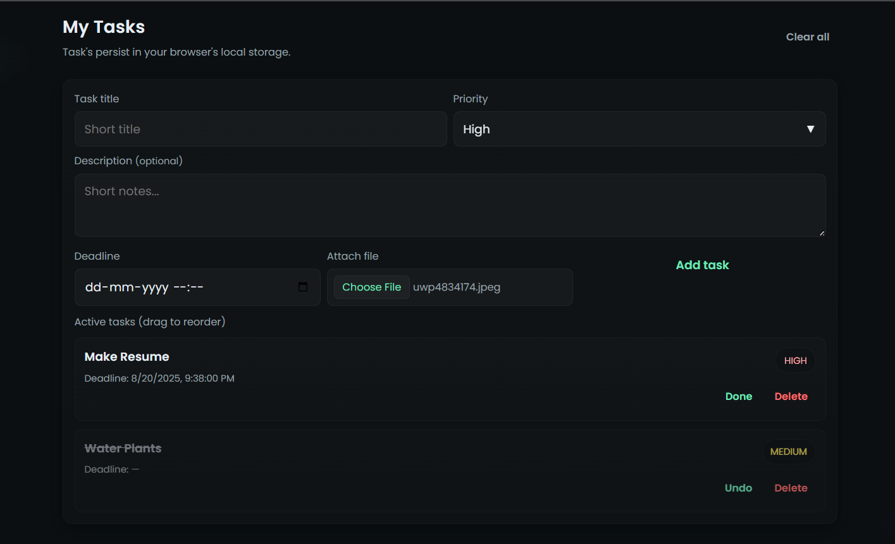

# TaskBuddy 📋✨

A minimal task management website.
Cooked up in 30 minutes for personal use. 😊

## Features 🌟

- ✅ Add, edit, and delete tasks with priorities
- 🏷️ Drag & drop to reorder tasks  
- 📁 Attach files to tasks
- 💾 Local storage - no server needed

Built with vanilla HTML, CSS, and JavaScript. �vanilla

## Screenshot 📸

## Usage 🚀

### Local Hosting 🏠
Just open `index.html` in your browser. That's it!

### Deploy on Vercel ☁️
1. Push your code to GitHub
2. Connect your GitHub repo to Vercel  
3. Deploy with one click

## License 📜

This project is licensed under the MIT License - see the [LICENSE](LICENSE) file for details.
